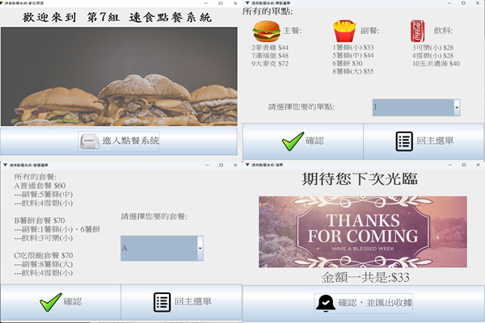

# java_ordering_system
中央大學java程式設計期末專題

## 組員
林俊霆 洪琬哲 謝理致 陳侑宣

## 程式畫面

## UML圖
.png)

## 功能/特色
+ 必要功能
  - 使用上課所講授的 OO 設計
  - 各組開發的點餐機之餐點與價格必須統一(請使用助教給的餐點、價格資料(見附檔)，禁止使用其他餐點、價格等等。但可因自行發想的活動去新增欄位、
增加資料數)
  - 步驟一：需要列出所有的餐點以及套餐(可直接複製 CSV 檔的內容至程式碼內變成一個陣列)
  - 步驟二：點餐部分包含新增、刪減、修改訂單
    * 單點：例如單點一個漢堡、薯條
  - 步驟三：列出總金額及點餐明細
+ 加分功能(包含課程範圍外的程式運用等自我探索)
  - 拆分 package 並且使用修飾符號(public、private、protected)以達到最佳安全性
  - 讀取餐點資料：直接讀取 CSV 並建立 Entity Class 來創造 Object
  - 可自行設計新穎的活動程式設計 Program Design 2021 Spring
  - 設計更佳的介面
    * 例如升級對話方塊為含圖像或聲音等、甚至嘗試使用 JFrame
  - 點餐功能再升級/優化。舉例說明：
    * 可輸入優惠代碼：輸入優惠代碼自動帶入餐點
    * 套餐：例如套餐有 A、B、C、D、E 餐，點 A 餐要自動帶入 A 套餐內容，然後可以替換餐點的內容
      + 1\. 一個主餐最多搭配一個套餐
      + 2\. 一個套餐有 1~2 個附餐，且含一杯飲料
      + 3\. 主餐不可更動
      + 4\. 同是「附餐」類別，可相互更換
      + 5\. 同是「飲料」類別，可相互更換
      + 6\. 更換餐點後，價格也會隨之更改，請取兩個餐點之差額進行增減。

+ 第二部分加分功能幾乎都有完成
+ 額外的功能
  - 10點半自動換菜單
  - 匯出txt檔收據、而且還有一個txt存歷史交易紀錄
  - 自動匯入CSV檔
  - 套餐可更換副餐、飲料
  - 特別的使用者介面設計
  - 使用Jframe
  - 有插入圖片、incon美化
  - 課堂外所運用到之概念或API/JDK 
    Java.Io 、java.net、java.text、java.swing、java.awt
  - 資料庫(CSV檔)可擴充，不像有些組別的已經寫死，無法增加菜單
  - 若餐點有差額會跳出提示視窗	
  -最後的檔案直接打包成jar檔，執行jar檔即可進入系統
